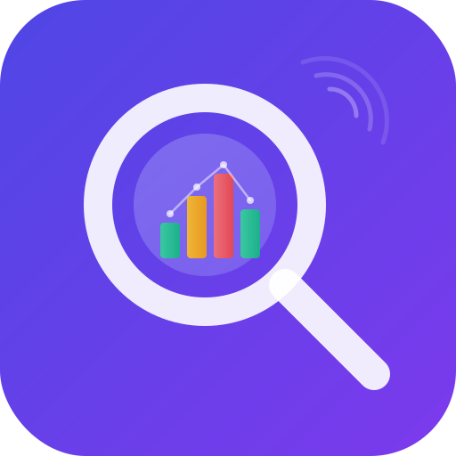

<p align="center">
  
</p>

<h1 align="center">TrackSight</h1>

<p align="center">
  <strong>See every analytics event. In real-time.</strong>
</p>

<p align="center">
  
  
  
  
  
</p>

<p align="center">
  A Chrome extension that intercepts and inspects analytics events from <strong>18+ popular trackers</strong> on any website.<br>
  Everything runs locally in your browser. No data ever leaves your machine.
</p>

---

## What it does

TrackSight sits in your browser toolbar and DevTools panel. When you visit a page, it automatically detects analytics trackers and shows you every event they fire — in real-time, with full decoded payloads.

**Dashboard view** gives you an instant overview of all active trackers on the page:

> Tracker name, tracking IDs, event counts, top events, first/last seen timestamps

**Events view** lets you dive into individual events with parsed parameters and raw request data.

## Supported Trackers

| Tracker | Tracker | Tracker |
|:---|:---|:---|
| Google Analytics 4 | Facebook Pixel | TikTok Pixel |
| Google Universal Analytics | Segment | Snap Pixel |
| Google Tag Manager | Amplitude | Pinterest Tag |
| Yandex Metrica | Mixpanel | LinkedIn Insight |
| Hotjar | PostHog | Plausible |
| Heap | RudderStack | + Custom rules |

## Features

- **Real-time interception** of fetch, XHR, beacon, and pixel requests
- **Dashboard** with tracker cards showing IDs, event counts, and top events
- **Grouped event list** with search and per-tracker filtering
- **Parsed event detail** with human-readable parameters + raw request view
- **DevTools panel** with full feature parity to the popup
- **Custom trackers** via URL pattern matching
- **Keyword rules** for flexible request capture
- **Export** events as JSON or CSV
- **Dark mode** (light / dark / system)
- **Bilingual** UI (English / Russian)
- **Zero data collection** - everything stays in your browser

## Installation

### From source

```bash
# Clone the repo
git clone https://github.com/ComsiComsa/TrackSight.git
cd tracksight

# Install dependencies
bun install

# Build
bun run build
```

Then load into Chrome:

1. Open `chrome://extensions`
2. Enable **Developer mode** (top right)
3. Click **Load unpacked**
4. Select the `dist/` folder

### Development

```bash
bun run dev
```

Vite will watch for changes and rebuild automatically. Reload the extension in Chrome to see updates.

## How it works

```
Page context (injected.js)
  | monkey-patches fetch / XHR / beacon / Image.src
  v
Content script
  | forwards intercepted requests via chrome.runtime
  v
Background service worker
  | runs requests through 18 built-in parsers + custom rules
  | stores parsed events per tab (in memory only)
  v
Popup / DevTools panel
  | receives events via chrome.runtime.connect port
  | renders dashboard, event list, event detail
```

All data lives in memory only and is discarded when the tab closes.

## Tech Stack

| | |
|---|---|
| **UI** | Svelte 5 |
| **Styling** | Tailwind CSS 4 |
| **Build** | Vite 6 + @crxjs/vite-plugin |
| **Language** | TypeScript |
| **Extension** | Chrome Manifest V3 |

## Project Structure

```
src/
  background/       Service worker - event parsing & storage
  content/          Content script + page-context injector
  popup/            Popup UI (Svelte)
    components/     Dashboard, Events, EventDetail, Settings, etc.
  devtools/         DevTools panel (shares popup components)
  parsers/          18 tracker parsers + custom/keyword rules
  types/            TypeScript interfaces & translations
public/icons/       Extension icons
```

## Built with AI

This project is developed with the help of [Claude Code](https://claude.ai/code) (Anthropic). AI assists with code generation, architecture decisions, and development workflow — while all design and product decisions are made by the developer.

## Privacy

TrackSight does not collect, store, or transmit any data. Everything is processed locally in your browser. See [PRIVACY.md](PRIVACY.md) for details.

## License

[MIT](LICENSE) - ComsiComsa
